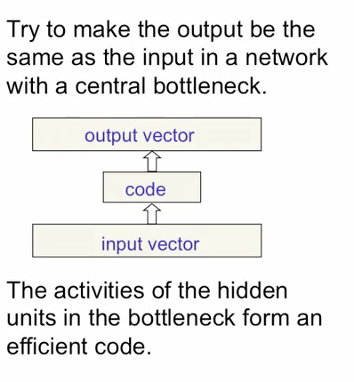

# autoencoder
Implementation of the [Reducing the Dimensionality of Data with Neural Network – G. E. Hinton and R. R. Salakhutdinov](https://www.cs.toronto.edu/~hinton/science.pdf) paper.

# Notes

Aim to minimise the squared reconstruction error using backpropagation.

If the neuron activation functions are linear, it will learn a compact encoding in the hidden units that is a linear function of the data. Exactly the same result as PCA (but probably less efficient). The M hidden units will span the same space as the first M components of PCA, but they may not be orthogonal.

If the activation functions are *non-linear*, it's able to represent data on a *non-linear manifold* – more powerful than PCA.

## Deep Autoencoders

Learning time is linear (or better) in the number of training cases.

# MNIST Digits
### Network

Encoding: 784 (pixels) -> 1000 -> 500 -> 250 -> 30 linear units [central code layer]

Decoding: 30 linear units -> 250 -> 500 -> 1000 -> 784 pixel [reconstruction]

First trained by stacking RBMs to get the 30 hidden units. Transpose of those weights used for decoding. Then fine-tune with backprop with cross-entropy error.

MNIST digits are continuous valued [0,1] and very non-Gaussian. 
RBM units pre-trained as follows:

First layer (784 <-> 1000 units):

  - hidden units are binary (bernoulli with activation probability given by logistic).
  - visible units are linear with Gaussian noise

Second layer (1000 <-> 500 units) and third layer (500 <-> 250):

  - hidden units are binary (bernoulli using probability of 1 given by logistic).
  - visible units are continuous (activation probabilities of the hidden units in the preceding layer.

Top layer (250 <-> 30):
  - hidden units have stochastic real-values states drawn form a unit variance Gaussian whose mean was is determined by the input from the that RBM's logistic visible units.

For fine-tuning, the model is "unfolded" and stochastic activities are are replaced by deterministic real-valued probabilties. Top layer is a linear, every other layer is logistic.

# Resources

- [Original Paper](https://www.cs.toronto.edu/~hinton/science.pdf)
- [Supporting Online Material](http://science.sciencemag.org/content/suppl/2006/08/04/313.5786.504.DC1)
- [Deep Autoencoder implemented in TensorFlow](https://gist.github.com/saliksyed/593c950ba1a3b9dd08d5)
- [Geoff Hinton Lecture on autoencoders](https://class.coursera.org/neuralnets-2012-001/lecture/161)
[A Practical guide to training RBMs](http://www.cs.toronto.edu/~hinton/absps/guideTR.pdf)
[An Introduction to Restricted Boltzmann Machines](http://image.diku.dk/igel/paper/AItRBM-proof.pdf)